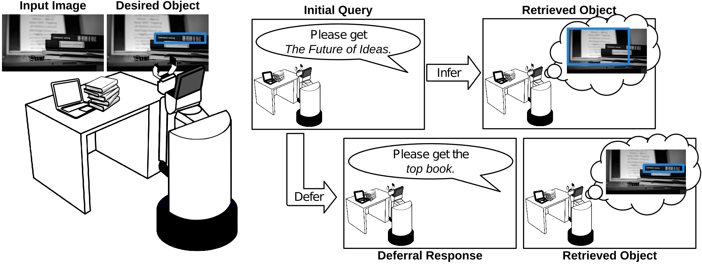

# Human-Centered Deferred Inference
This is the repository for the IUI2023 paper titled: *Human-Centered Deferred Inference: Measuring User Interactions and Setting Deferral Criteria for Human-AI Teams.* Citation information will be added soon.

## Abstract
Although deep learning holds the promise of novel and impactful interfaces, realizing such promise in practice remains a challenge: since dataset-driven deep-learned models assume a one-time human input, there is no recourse when they do not understand the input provided by the user. Works that address this via deferred inference—soliciting additional human input when uncertain—show meaningful improvement, but ignore key aspects of how users and models interact. In this work, we focus on the role of users in deferred inference and argue that the deferral criteria should be a function of the user and model as a team, not simply the model itself. In support of this, we introduce a novel mathematical formulation, validate it via an experiment analyzing the interactions of 25 individuals with a deep learning-based visiolinguistic model, and identify user-specific dependencies that are under-explored in prior work. We conclude by demonstrating two human-centered procedures for setting deferral criteria that are simple to implement, applicable to a wide variety of tasks, and perform equal to or better than equivalent procedures that use much larger datasets.

## Environment
The conda environment I used at all steps (collection and analysis) is included in environment.yml. However, it has some extraneous packages from previous experiments. It is also unlikely that the apex library will install correctly. This is not necessary for the analysis steps, but it is necessary for running the data collection.

## Analysis
All analysis steps assume that you have downloaded the [experimental data](https://drive.google.com/file/d/1BzIjbCPyQBVH3uTGIcem83y8CJygwRwZ/view?usp=sharing) to the folder `user_trackers`. Outlier users (removed in our analysis) can be downloaded [here](https://drive.google.com/file/d/1O3cgEaESQ7KLooV72iC_TGUmZHmOeaPQ/view?usp=sharing). Release of anonymized data was approved by the University of Michigan IRB.

### Removing outliers
If you download the outlier users, you can see our script identify them via the command `python analysis/find_outliers.py` from the repository root directory. Note that this does not alter the filesystem---these files must be deleted manually before performing any other analysis.

### Demographic data
`python analysis/demographic_data.py`

### RQ1: Is user satisfaction related to error and deferral rate?
`python analysis/rq1_user_preferences.py`
### RQ2: What are the time dependencies of error, e, and deferral score, s?
`python analysis/rq2_time_variance_tests.py` produces fig. 5 and the points where the conditions are met.

`python analysis/rq2_time_variance_plots.py` produces fig. 6.

### RQ3: Do deferral scores vary meaningfully between users?
`python analysis/rq3_users_all_comparison.py` for statistical results and `python analysis/rq3_same_err_diff_dist.py` produces Fig 7, and compares the different users with the same error.

### RQ4: How do users respond when inference is deferred?
`python analysis/rq4_depth_diff.py` outputs the results, as well as the tsv containing correlated initial queries and deferral responses used for table 1 (also uploaded [here](first_second_phrases.tsv).

`python analysis/rq4_does_deferral_help.py` performs tests to determine if deferral improves accuracy.

### RQ5: Does knowing the user provide additional information about the mapping between probability of error and deferral score?
`python analysis/rq5_permutation_test.py`

### Targeting a deferral rate
`python analysis/target_deferral_rate.py`

## Experimental Apparatus
### Downloading weights
Model weights for UNITER can be downloaded [here](https://drive.google.com/file/d/1ybo4jqf63rzM4fY3-VwcJ7VPKtUFZg-S/view?usp=sharing). They should be downloaded to the directory net_weights/ckpt/.

### Download images and features
download the [images and features](https://drive.google.com/file/d/19xjk7WnDxLLs9IKcE8atA8q9bIDNZith/view?usp=sharing), which should be unzipped to scenarios/iui_2023_scenario. The features correspond to the tasks used in our study [scenarios/iui_2023_scenario.csv](scenarios/iui_2023_scenario.csv).

### Running the webapp
Add the current directory (human-centered-deferred-inference) to the python path. This is necessary for the import of scenario_manager.py:
`export PYTHONPATH=$(pwd)`

Update the ssl_context in `app.run()` of `webapp.py` (last line).

`python webapp.py --scenario_category iui_2023_scenario --consent_form regular --rqd_constraint 1`

# NB: terminology in code
In the codebase, you will occasionally encounter the term requery. The terminology or our work changed while the paper was being written, and requery can be read interchangeably with deferral.
